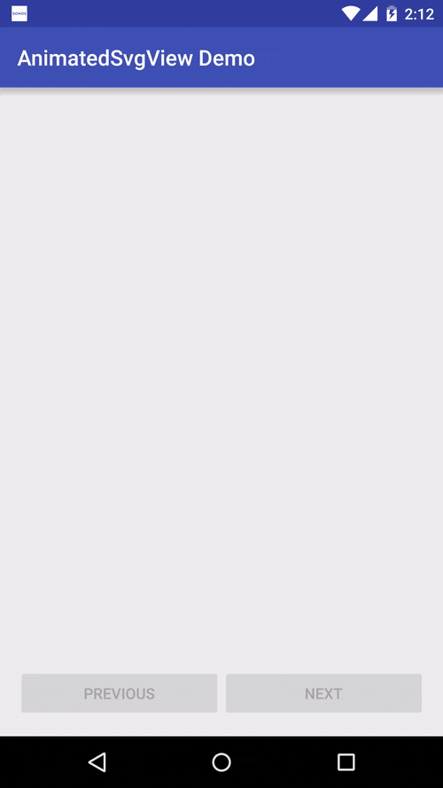

# AnimatedSvgView

[](https://maven-badges.herokuapp.com/maven-central/com.jrummyapps/animated-svg-view)
[](LICENSE)
[](https://android-arsenal.com/api?level=14) 
[](https://twitter.com/jrummy16)

Animated SVG Drawing for Android



# Usage

Get SVG path data and add it to a string array:

```xml
<string-array name="google_glyph_strings">
  <item>M142.9,24.2C97.6,39.7,59,73.6,37.5,116.5c-7.5,14.8-12.9,30.5-16.2,46.8c-8.2,40.4-2.5,83.5,16.1,120.3   c12.1,24,29.5,45.4,50.5,62.1c19.9,15.8,43,27.6,67.6,34.1c31,8.3,64,8.1,95.2,1c28.2-6.5,54.9-20,76.2-39.6   c22.5-20.7,38.6-47.9,47.1-77.2c9.3-31.9,10.5-66,4.7-98.8c-58.3,0-116.7,0-175,0c0,24.2,0,48.4,0,72.6c33.8,0,67.6,0,101.4,0   c-3.9,23.2-17.7,44.4-37.2,57.5c-12.3,8.3-26.4,13.6-41,16.2c-14.6,2.5-29.8,2.8-44.4-0.1c-14.9-3-29-9.2-41.4-17.9   c-19.8-13.9-34.9-34.2-42.6-57.1c-7.9-23.3-8-49.2,0-72.4c5.6-16.4,14.8-31.5,27-43.9c15-15.4,34.5-26.4,55.6-30.9   c18-3.8,37-3.1,54.6,2.2c15,4.5,28.8,12.8,40.1,23.6c11.4-11.4,22.8-22.8,34.2-34.2c6-6.1,12.3-12,18.1-18.3   c-17.3-16-37.7-28.9-59.9-37.1C228.2,10.6,183.2,10.3,142.9,24.2z</item>
  <item>M142.9,24.2c40.2-13.9,85.3-13.6,125.3,1.1c22.2,8.2,42.5,21,59.9,37.1c-5.8,6.3-12.1,12.2-18.1,18.3    c-11.4,11.4-22.8,22.8-34.2,34.2c-11.3-10.8-25.1-19-40.1-23.6c-17.6-5.3-36.6-6.1-54.6-2.2c-21,4.5-40.5,15.5-55.6,30.9    c-12.2,12.3-21.4,27.5-27,43.9c-20.3-15.8-40.6-31.5-61-47.3C59,73.6,97.6,39.7,142.9,24.2z</item>
  <item>M21.4,163.2c3.3-16.2,8.7-32,16.2-46.8c20.3,15.8,40.6,31.5,61,47.3c-8,23.3-8,49.2,0,72.4    c-20.3,15.8-40.6,31.6-60.9,47.3C18.9,246.7,13.2,203.6,21.4,163.2z</item>
  <item>M203.7,165.1c58.3,0,116.7,0,175,0c5.8,32.7,4.5,66.8-4.7,98.8c-8.5,29.3-24.6,56.5-47.1,77.2    c-19.7-15.3-39.4-30.6-59.1-45.9c19.5-13.1,33.3-34.3,37.2-57.5c-33.8,0-67.6,0-101.4,0C203.7,213.5,203.7,189.3,203.7,165.1z</item>
  <item>M37.5,283.5c20.3-15.7,40.6-31.5,60.9-47.3c7.8,22.9,22.8,43.2,42.6,57.1c12.4,8.7,26.6,14.9,41.4,17.9    c14.6,3,29.7,2.6,44.4,0.1c14.6-2.6,28.7-7.9,41-16.2c19.7,15.3,39.4,30.6,59.1,45.9c-21.3,19.7-48,33.1-76.2,39.6    c-31.2,7.1-64.2,7.3-95.2-1c-24.6-6.5-47.7-18.2-67.6-34.1C67,328.9,49.6,307.5,37.5,283.5z</item>
</string-array>
```

Add the colors for each path in an integer-array:

```xml
<color name="google_red">#EA4335</color>
<color name="google_yellow">#FBBC05</color>
<color name="google_blue">#4285F4</color>
<color name="google_green">#34A853</color>

<integer-array name="google_glyph_colors">
  <item>@android:color/white</item>
  <item>@color/google_red</item>
  <item>@color/google_yellow</item>
  <item>@color/google_blue</item>
  <item>@color/google_green</item>
</integer-array>
```

Add the view to your layout:

```xml
<com.jrummyapps.android.widget.AnimatedSvgView
    android:id="@+id/animated_svg_view"
    android:layout_width="180dp"
    android:layout_height="180dp"
    android:layout_gravity="center"
    android:layout_marginBottom="25dp"
    app:animatedSvgFillColors="@array/google_glyph_colors"
    app:animatedSvgGlyphStrings="@array/google_glyph_strings"
    app:animatedSvgFillStart="1200"
    app:animatedSvgFillTime="1000"
    app:animatedSvgImageSizeX="400"
    app:animatedSvgImageSizeY="400"
    app:animatedSvgTraceTime="2000"
    app:animatedSvgTraceTimePerGlyph="1000"/>
```

Play the animation:

```java
AnimatedSvgView svgView = (AnimatedSvgView) findViewById(R.id.animated_svg_view);
svgView.start();
```

You can also set SVG glyphs and colors dynamically (see the [demo](demo)).

# Download

Download [the latest AAR](https://repo1.maven.org/maven2/com/jrummyapps/animated-svg-view/1.0.1/animated-svg-view-1.0.1.aar) or grab via Gradle:

```groovy
compile 'com.jrummyapps:animated-svg-view:1.0.1'
```
or Maven:
```xml
<dependency>
  <groupId>com.jrummyapps</groupId>
  <artifactId>animated-svg-view</artifactId>
  <version>1.0.1</version>
  <type>aar</type>
</dependency>
```

# Dependencies

Animated Vector Drawable

```groovy
compile 'com.android.support:animated-vector-drawable:${latest_version}'
```

# Acknowledgements

[AnimatedMuzeiLogoView](https://github.com/romannurik/muzei/blob/master/main/src/main/java/com/google/android/apps/muzei/util/AnimatedMuzeiLogoView.java) by [Roman Nurik](https://github.com/romannurik)

[oak-animatedsvgview](https://github.com/willowtreeapps/OAK/tree/master/oak-animatedsvgview) by [WillowTree, Inc.](https://github.com/willowtreeapps)

# License

    Copyright (C) 2016, Jared Rummler

    Licensed under the Apache License, Version 2.0 (the "License");
    you may not use this file except in compliance with the License.
    You may obtain a copy of the License at

       http://www.apache.org/licenses/LICENSE-2.0

    Unless required by applicable law or agreed to in writing, software
    distributed under the License is distributed on an "AS IS" BASIS,
    WITHOUT WARRANTIES OR CONDITIONS OF ANY KIND, either express or implied.
    See the License for the specific language governing permissions and
    limitations under the License.
